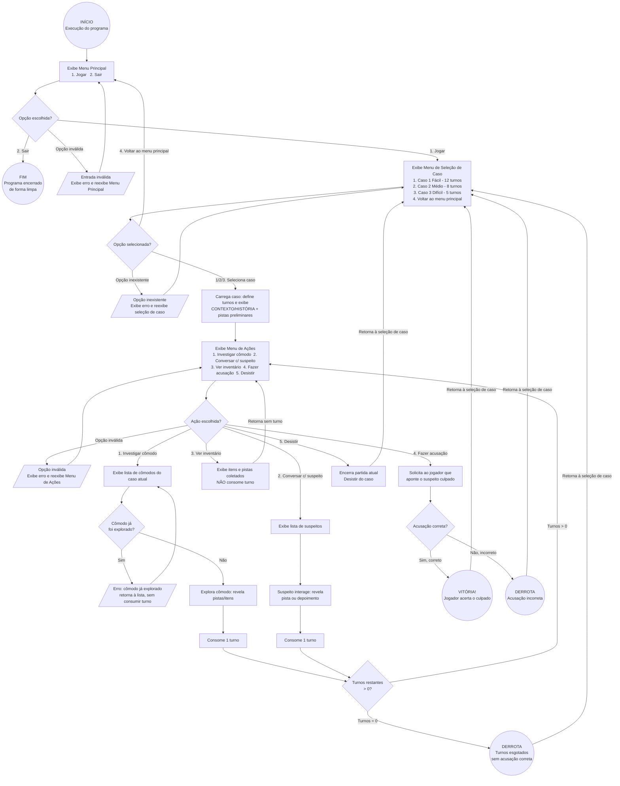

# Título do Projeto: Jogo de Detetive

## 1. Descrição do Sistema

O projeto consiste em um sistema de jogo de investigação desenvolvido em linguagem C. O sistema permitirá que o jogador escolha entre diferentes casos, cada um com um nível de dificuldade e uma quantidade específica de turnos para solucionar o mistério. Durante a investigação, o jogador poderá explorar cômodos, conversar com suspeitos, coletar pistas e consultar o inventário para reunir informações que auxiliem na descoberta do culpado.

O foco principal é proporcionar uma experiência de investigação baseada na tomada de decisões e no gerenciamento de turnos. Ao longo da partida, o jogador deverá analisar as informações obtidas, definir suas ações e administrar os recursos disponíveis para avançar na investigação. O sistema acompanhará o progresso da partida e, ao final, avaliará a decisão do jogador, determinando o desfecho do caso. Entradas inválidas serão tratadas de forma adequada, mantendo a continuidade e a organização da navegação entre as etapas do jogo.

---

## 2. Fluxo de Utilização Esperado para o Sistema

O fluxo apresentado a seguir representa o funcionamento planejado para o sistema durante as próximas etapas de desenvolvimento. As funcionalidades serão implementadas gradualmente conforme os conteúdos da disciplina forem apresentados e estudados. A versão atual do código contempla apenas parte dessas funcionalidades, de acordo com os conceitos já abordados em aula.

1. Ao iniciar o programa, o usuário visualizará o menu principal com as opções:
   - `1. Jogar`
   - `2. Sair`
2. Caso o usuário escolha `Jogar`, o sistema exibirá o menu de seleção de caso, apresentando a lista de níveis disponíveis com a quantidade de turnos de cada um:
   - `1. Caso 1 (Fácil) - 12 turnos`
   - `2. Caso 2 (Médio) - 8 turnos`
   - `3. Caso 3 (Difícil) - 5 turnos`
   - `4. Voltar ao menu principal`
3. Ao selecionar um caso, o usuário visualizará o contexto/história inicial junto ao menu de ações da investigação:
   - **CONTEXTO - HISTÓRIA** (exibe a narração inicial e as pistas preliminares do caso)
   - `1. Investigar um cômodo`
   - `2. Conversar com um suspeito`
   - `3. Ver inventário`
   - `4. Fazer uma acusação`
   - `5. Desistir do caso`
4. Ao escolher `Investigar um cômodo`, o sistema exibirá a lista de cômodos do caso. Ao selecionar e explorar um cômodo, o jogador poderá encontrar pistas e itens que são adicionados ao inventário. Essa ação consome 1 turno da investigação.
5. Ao escolher `Conversar com um suspeito`, o sistema apresentará a lista de suspeitos disponíveis. Ao interagir, o suspeito pode revelar pistas ou depoimentos que auxiliam na resolução. Essa ação consome 1 turno da investigação.
6. Ao escolher `Ver inventário`, o jogador consulta todos os itens e pistas já coletados durante a investigação. Essa consulta não consome turno.
7. Quando o jogador optar por `Fazer uma acusação`, o sistema solicitará que aponte o culpado entre os suspeitos. Se a acusação estiver correta, o jogador vence o jogo; se estiver incorreta, o caso é encerrado como derrota.
8. Caso escolha `Desistir do caso`, o jogador encerra a partida atual e retorna à tela de seleção de caso.
9. O sistema controla rigorosamente o limite de turnos de cada caso. Ações de investigação consomem turnos; se os turnos se esgotarem sem uma acusação correta, o jogo termina com derrota e exibe a mensagem de fim de jogo.
10. As operações de erro (entradas inválidas, opções inexistentes ou cômodos já explorados) exibirão mensagens claras e retornarão o usuário ao menu correspondente, sem perda do progresso da sessão.
11. Ao escolher `Sair` no menu principal, o programa é encerrado de forma limpa.

---

## 3. Fluxograma da Lógica do Sistema

---

## 4. Estrutura de Dados
Estruturas de dados planejadas: as estruturas abaixo representam a organização dos dados prevista para as próximas etapas do desenvolvimento. Sua implementação ocorrerá conforme os conteúdos necessários forem apresentados na disciplina.

O sistema utilizará estruturas heterogêneas (struct) para organizar as principais informações utilizadas durante a investigação. As estruturas previstas são:

```c
// Estrutura para armazenamento dos casos
typedef struct {
    char titulo[80];
    char historia[500];
    int culpado;
    char resolucao[500];
} Caso;

// Estrutura para armazenamento dos personagens
typedef struct {
    char nome[40];
    char papel[40];
    char fala[500];
    int suspeito;
} Personagem;

// Estrutura para armazenamento das pistas
typedef struct {
    char descricao[500];
    char item[60];
    int encontrada;
} Pista;

// Estrutura para armazenamento dos cômodos
typedef struct {
    char nome[40];
    char descricao[200];
    Pista pistas[3];
    int explorado;
} Comodo;

// Estrutura para controle da investigação
typedef struct {
    Caso caso;
    int dificuldade;
    int turnos_restantes;
    int caso_resolvido;
} Investigacao;
