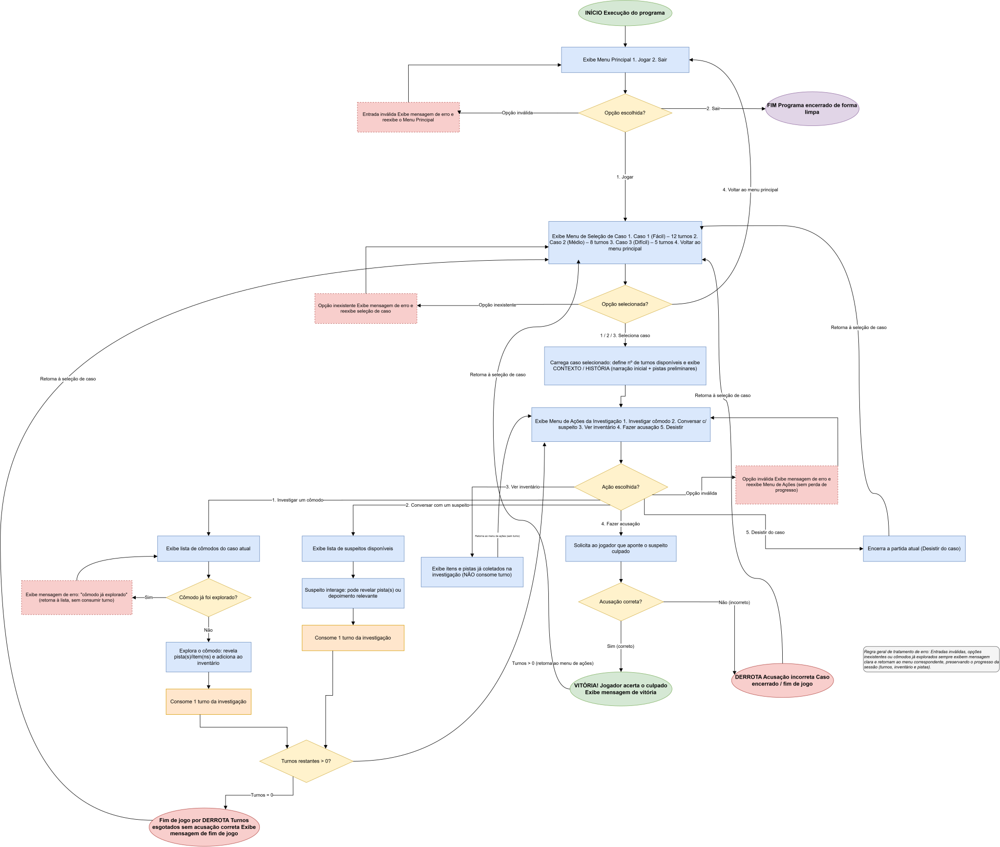

# Título do Projeto: Detetive

## 1. Descrição do Sistema

O projeto consiste em um sistema de jogo de investigação desenvolvido em linguagem C. O sistema permitirá que o jogador escolha entre diferentes casos, cada um com um nível de dificuldade e uma quantidade específica de turnos para solucionar o mistério. Durante a investigação, o jogador poderá explorar cômodos, conversar com suspeitos, coletar pistas e consultar o inventário para reunir informações que auxiliem na descoberta do culpado.

O foco principal é proporcionar uma experiência de investigação baseada na tomada de decisões e no gerenciamento de turnos, permitindo que o jogador analise as pistas disponíveis e escolha as melhores ações para solucionar cada caso. Ao final da investigação, o jogador deverá realizar uma acusação e, caso identifique corretamente o culpado, vencerá o jogo. Caso contrário, ou se os turnos forem esgotados sem uma acusação correta, a partida será encerrada com derrota.

---

## 2. Fluxo de Utilização Esperado para o Sistema

Apresenta-se a seguir o fluxo completo de navegação e as etapas de interação do usuário durante a execução do jogo:

1. Ao iniciar o programa, o usuário visualizará o menu principal com as opções:
   - `1. Jogar`
   - `2. Sair`
2. Caso o usuário escolha `Jogar`, o sistema exibirá o menu de seleção de caso, apresentando a lista de níveis disponíveis com a quantidade de turnos de cada um:
   - `1. Caso 1 (Fácil) - 12 turnos`
   - `2. Caso 2 (Médio) - 8 turnos`
   - `3. Caso 3 (Difícil) - 5 turnos`
   - `4. Voltar ao menu principal`
3. Ao selecionar um caso, o usuário visualizará o contexto/história inicial junto ao menu de ações da investigação:
   - **CONTEXTO - HISTÓRIA** (exibe a narração inicial e as pistas preliminares do caso)
   - `1. Investigar um cômodo`
   - `2. Conversar com um suspeito`
   - `3. Ver inventário`
   - `4. Fazer uma acusação`
   - `5. Desistir do caso`
4. Ao escolher `Investigar um cômodo`, o sistema exibirá a lista de cômodos do caso. Ao selecionar e explorar um cômodo, o jogador poderá encontrar pistas e itens que são adicionados ao inventário. Essa ação consome 1 turno da investigação.
5. Ao escolher `Conversar com um suspeito`, o sistema apresentará a lista de suspeitos disponíveis. Ao interagir, o suspeito pode revelar pistas ou depoimentos que auxiliam na resolução. Essa ação consome 1 turno da investigação.
6. Ao escolher `Ver inventário`, o jogador consulta todos os itens e pistas já coletados durante a investigação. Essa consulta não consome turno.
7. Quando o jogador optar por `Fazer uma acusação`, o sistema solicitará que aponte o culpado entre os suspeitos. Se a acusação estiver correta, o jogador vence o jogo; se estiver incorreta, o caso é encerrado como derrota.
8. Caso escolha `Desistir do caso`, o jogador encerra a partida atual e retorna à tela de seleção de caso.
9. O sistema controla rigorosamente o limite de turnos de cada caso. Ações de investigação consomem turnos; se os turnos se esgotarem sem uma acusação correta, o jogo termina com derrota e exibe a mensagem de fim de jogo.
10. As operações de erro (entradas inválidas, opções inexistentes ou cômodos já explorados) exibirão mensagens claras e retornarão o usuário ao menu correspondente, sem perda do progresso da sessão.
11. Ao escolher `Sair` no menu principal, o programa é encerrado de forma limpa.

---

## 3. Fluxograma da Lógica do Sistema
https://viewer.diagrams.net/?tags=%7B%7D&lightbox=1&highlight=0000ff&edit=_blank&layers=1&nav=1&title=fluxograma_jogo_investigacao.drawio&dark=auto#R%3Cmxfile%3E%3Cdiagram%20name%3D%22Fluxo%20-%20Jogo%20de%20Investigacao%22%20id%3D%22flow-invest-1%22%3E3V1bd5u4Fv4t54G10od4IcT1MXGSmZy10nY1XT2dR4JlmxmMPIDTZH79kQTiIrADsgz2pG0KAmHY39a%2BfNrCGpxv3n5L%2FO36CS9QpBn64k2Dd5phWNCE5D%2Fa8p63ANvU85ZVEi6KtqrhOfwHFY38tF24QGnjxAzjKAu3zcYAxzEKskabnyT4V%2FO0JY6an7r1V6jV8Bz4Ubv1f%2BEiW%2Bethqnr1YHfUbhaFx8NyyMbn59dNKRrf4F%2F1ZrgvQbnCcZZvrV5m6OIio8LJu%2F3sOdoeWcJirM%2BHeKOHkVTmr3zByZ9iGzJzu2vdZih560f0CO%2FCL6kbZ1tIrIHyOYyjKI5jnDC%2BsGFhdyFSdrTLMF%2FodoR13iBtk174DgrEAaQ7xefTK%2BY38urH%2B2Ke3n8rM2h5t7NH7%2BQA%2FdvKNjRhhuH%2FYaYKhb9tU3wKvE3fnEBlGTorfZ8hTh%2BQ3iDsuSdnLKuIWYX8Pyqwcsh41fRudYWasyP%2B4V2rcpLV%2FInGwUEe%2BAw%2BsCR4F28QLSLPhwSH7nLoAsSO3DRy1KAxOiC4P4tfEGk6QnFO%2FLf1ySMg3Dr0wcBM%2FLrv3jlJxqVB%2F1r0KZnP0xUIQF1EQm9iQSAKqCAvaBY483LLh0Mw3K5NIJOGBb2i22JI6MThi9bUfFRGuBoHS58DT5ISduT0XtThbTNU9ohBIglcrqk7dkO9KXs0MPjE9N9bmV0FAcoSXxmfBaI%2BZWEHYjCzVbODLk94DBdAQ5oHQ8HeZAnP4xPbYyWboC6R8GLa5mWLuBCr7Dw0zX7tE5Q7uOMIECFHsavbFyAKGT73GZtUJwS97zhIJEnZSOH%2FEsQKk7CncZNAkCnA0CzCaBlCPjZKoaTdYF%2BhOHxjMjdif6cHpj7KeYOhm%2BTf1cPOcxBGH2i%2Fube0MiA8CA9zALDXRLjlLuhoiM9cPXEOnqLEIsd3Xo%2FWOtHD17dhUvW867jI616T5P2%2FEHiUuYMfZxr347FJscoFdA7fKLd1CrPaWqVpcRI2%2BfuEjXDjrLiRLK9otttN5kSHQtCHPuFo8z7kKevdxvNf9qeAmiIGSM6ii7OYLfBCWNihdOMPAAaarbTfbYjYMP3NPbbFOy3A1SMNOcS7PecJNNo5ZcCrg0srMEbJv0lwZNsxNrc0G5vOCCljVyE6RbHuT19RWFaYMoRnX%2F5%2FP3%2B53ea6VHZGfrvj8%2Ff6dke%2FPZIr3YVk3vw2zoUBiHLRzTjloqRKJSfMsOLSDQWkk4o%2FaRqhENXsL12UyNcFRFZ7F6CRnR59JsKnVsLMdCpyjzGryjNwlULPObhy6PUdQasr7nBLLYufTkm5yRpcQbTjnSXblGYYe62f6CEacMrFRkLE5KwuARzzg%2F%2BP%2BwMP9ilrfug7pyedIdSoj6S6WtHBG8KDsGDTXXxHFeBunjn7qpvlCevAPTxvoK0AVBhr4k7ugkyYvn%2BFQ74iMzp8MC%2FSln3LUrYldlZjKdDaYqV2WPRQwMTtDBXYZH5VS%2FDJEfUB5YBUWVRmUHGlQ%2F3s51kXtJFmorJrgBEaR%2BPA6IXiT2lsZs3PNif%2BfjSKEUUsmhnS67JgiZ1tJ1Akgr5IIBqJG9cnME7aM5Y0EoywL93dALmNtgDWwVYeSq1bgnKcBLTQcbO1KtRN6cCYZ8V4DjdbWg0kQfBclavixgUGIDrDsiVWL1%2BvPjkVo8hpOVcXh1HBnGCXlFEj7LM4IrmAg%2FkFjdXMd1kPs1fhCyV0QrqphVFKkonPxinlpK5DNCLXj9qnC6RvcdKOt6LLo7TbitJxgZ5OC1n9tjw0IpsIdyTLShyUx%2BAYCthz8BFpXCNeIEnVt0p%2B2liBeidJljolxlNjMJzlcmGcYYSVpFALdcWL1BpwJKGBdNxHnpvcUicG%2BuboAi9%2BoxKOw371QJJTVxhnDy0vmx79REKpgpOOe4qJzm%2FocINFvncmPOHJeFXxWwBjlDm5%2FlOfAgi%2FSqvMIFfinAth%2FiIaK3HOLJbwZoav99vHnDCzOg7Z4ITAga1VGkegRdzMHQgSrJBHbNkIhtkiOPGUTL5CnrNk8kWMwzMiPoVM4RlHvQnXrHyKUydy939t29fvlO%2FU%2BKE0hXm4yhPaTrZ0wAnJB06xB8txc9UlPgKeZDI93lq6rROnvgqiSJwRJKYrMxhiJwJchTYv3csxyGBXMYLHmrkebCLtiy7VeSuBEiALhJyakI74%2BxLtm4ODZXTkT%2BtOWcA1QQIJ63aOkX16I%2FHavrwP1peqpiPCHJTSVYSBnwA7LVeryHjAm5hEqqr7RKJa12YWwa2rgS2XlHBOfmnyg91jqAwrtxNUapTr8bLJwdV%2BJs%2BoJliNaqlxrj1K76ZOhjPxU4fNr%2FXLJ9EKmYV9KtqNrWadZCLqnvkRcA5jaPBGRqYGoHhw8iifzrRYD8CGrowjCg6fhSuYrIdoSWNpql8w8CPbormDG%2B7IPyGVgzAFUoYZHnBRuJnPmcVBL68KLpMNWHuMM15b7xtzQPWanzoLuMthCmpDrK9iDi3SVkhsmka5iDy2Z3nBAnj4jc89Ckq75idoPzVIi8wojdILpii5NWPmUKWawfonKRWpPMp2akliLx8Za51VRdUCeinmSrNhuI8dkuzlVT4cbVGi9YKmLae410SIJ7ytN0HuQRXRpxka2JyYz%2B6r1pvm7aqPhKECR0UL27osh2y%2FxLh4K9SazM%2FWaGMG8iWJndLOkGRn4Wvzec7SmiGpNCM6YUGJxMalBQaHFloxNBkP4vT6fYf9CozaBW7d2%2FFVdnOO98hJvH9Z30n72bx3aob2%2BP9OhAyWwg1FtSMAZV5YVAVci7AAj2RqsD5o4FNb6SsFlL11VDjQGURt3xpaDUGVs9xBZrjyhyMVmOFy5B6qKNwZF2JIPz32glbHMZZWrvyV9pQ%2BXrH1mc6bHh7w7V4U6UZ%2BXUrPSlvsL%2FqvPgEGin1achz4hGv9xzxTR1yho%2F46UIOW3KQW9OHHPZkQnMkhWaPLLRgl7yWWWN3%2FCFnJiXCj7aK91zWNLaVBKZpzWDTTDpF5f3DgD7A1gWlqtnV9hUMgVl1gDHzbFj%2BEUqucr0qLnLozqBYKinOTOUota4kY%2FndCxkXE8d3Tju%2B0zi5aJRbbOHBM18Io1WLj8awcJ58%2BDcZmFOFf9V6uf7r0cZD8ahIrHq0i4zEbBW511hgcR5u8IBzpg%2FF3OmkJks0utNLzZtOarJMozeZNaiHraN5aj4mRSqmsapwx6YM6hX%2BvUEsgjTieEgEuR9XIbTjp%2BDlMkVHB21AlkCdThfgJGEbaFu59vpRvOEaUZXBDFcH4JkH1m6eVh1kSdrR1UESWZl4sUMbuAxq2nBoqfBQHbgmNkF3VNiEwSyhWMsIbEtQqoOJLGhNlYsVqH1zV0esWoGmNzOa11KYvfIa13%2B%2F5g9Ie7s0fw%2BVc2gR%2FClpnP3cBxCr1Qyx7GmPKkqpjyyVOpUflYmojqcB26yt8HKE%2BiJiCc9p2sYHmlTpyXun6h1vQgHwrG4buJ9AdPdYzf49IDhAOEpptCPPAp2DUuszR252HcrQQPX3Now2D9g%2F43OO5YLqzzctrFLU3nBMp2Q1ZJl0HntNSWuAdmQ8mtw8WbmNXXemkrWWcMOcAKqv8aBlzSPVuclSnfy2p51BVUFNu0rIqNEAky7nPIN6TtCuTfysJjHpLz9ZvhWMXUzVJb925eBocpPlJvk9T0BOmjLcJDianJxu4sqQZQzBGczB8IhhCrnJ8k1g7OSqQ27GhM5Ilmgxxg6OazMWMkbBvWSjIFsjB8auLDwSJOdYjNqEWLlEnu3mlOUomElnnWNjpq6wsRGWg17wdSJVf9FE4w1u9bpGtt7Nb65i%2BzQA3YrlhEKx4fWhlxH0nipqkYwWcGeWA0zDzX%2BbjQ8FjmfNakctYc6y7zyP%2BJ5joNNC9dqP0byuwjkfQ5owOIta3iZ7ACVUXp95w21W2618a7%2Bx8MOXqA%2BeENUtFzS1vlXMOsoMKfRmQqmvZ%2FKmfTp%2BXS68PKKPDRUz%2FFCWiOla5j8FEeMcz8QYEvRZFzNc%2F8KImlz4ez3pgeuUPSRd62xv39ilq9d%2B5g7kW2%2FHoZWvQeZvlNr79RODR5pjOVDBwJJSSVmqiXMsk2ZFEy6DlaWYjDOgmIw2xcToaP0qfx8HHhIlHSdGWcZpdDGqC3ulJseMdhDwufZmA%2F4mlRGRk6WhjLG5wqYvq5GAtluHBcx08NE0Adv7ipKQyAslNcjlKtxGjeiI2pXfMVcGdB%2BVAZ0inhO%2F46p8Te%2FehEXsYJhwBpyDfVwSNYpFITK9HNf9qFPrLV3tPh8U8bUe0BLzy97rz3TyBJ7jlT9248K2WBuoMLeDsvyqcRZ0htwsY5XOSREao4x6W%2BARrg99c8rJRj0QvzCxfOXw%2FpKr1vfDDu3h2R90gM6RHQ7miB1CEF9r2XrJWP%2BVprD7Tk4ytqXnAM6DtymyzqMqmowLIm54cjbuCHdENwY%2BGq%2BOOMIH97Csozgaslt9aXt%2BeuJv1094gegZ%2Fwc%3D%3C%2Fdiagram%3E%3C%2Fmxfile%3E

  

## 4. Estrutura de Dados

**Exemplo:**
